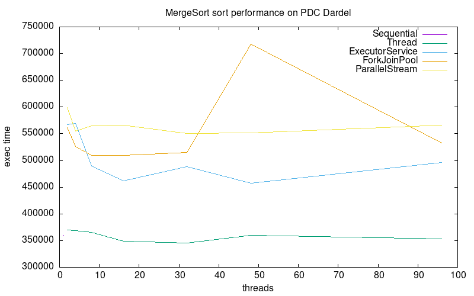

# Lab 2 - Java Parallel Programming and Sorting Algorithms

- Group 3
  de Sotto, Diego and Wei, Jian

## Task 1: Sequential Sort

We chose to implement MergeSort. The core strategy of MergeSort algorithm is divide-and-conquer. In divide stage, it divides the unordered sequence into two subsequences and then recursively sort them, while in conquer stage, it merges the two sorted subsequences into one ordered sequence.

The time complexity of MergeSort is O($nlog _2 n$). The time complexity is stable and will not fluctuate when sequence changes.

Source files:

- `SequentialSort.java`

## Task 2: Amdahl's Law

For the implementation of Mergesort algorithm, the sorting of the two subsequences can be done in parallel, but the merge operation can only be done by one thread after the two subsequences have been sorted. As the number of threads gets larger, the time complexity will decrease and the speedup ratio will increase.

According to the definition of Amdahl's law, the speedup S = time takes to execute the entire merge sort algorithm sequentially (with one thread)/time to execute the parallelized portion of the merge sort algorithm with x threads. The detailed formulas are shown below.

| Number of Threads |                              Time Complexity                              |       Amdahl's law/Speedup S        |
| :---------------: | :-----------------------------------------------------------------------: | :---------------------------------: |
|         1         |                                $nlog _2 n$                                |                  1                  |
|         2         |                   $\frac{n}{2} \log \_2 \frac{n}{2}+n $                   |  $\frac{2 \log _2 n}{1+\log _2 n}$  |
|         4         |              $\frac{n}{4} \log _2 \frac{n}{4}+\frac{n}{2}+n$              |  $\frac{4 \log _2 n}{4+\log _2 n}$  |
|         8         |        $\frac{n}{8} \log _2 \frac{n}{8}+\frac{n}{4}+\frac{n}{2}+n$        | $\frac{8 \log _2 n}{11+\log _2 n}$  |
|        16         | $\frac{n}{16} \log _2 \frac{n}{16}+\frac{n}{8}+\frac{n}{4}+\frac{n}{2}+n$ | $\frac{16 \log _2 n}{26+\log _2 n}$ |

Here is a plot of our version of Amdahl's law ...

We see that ...

## Task 3: ThreadSort

Implementation using start()/join() thread spawning. Everytime the array is divided for merge sort, the task of sorting this new array is spawned to a new thread, hence, the parallelism is achieved by recursion. Each new recursion level has the available threads halved.

It is important to join the threads to ensure the sorting is complete before merging them together.

Source files:

- `src/ThreadSort.java`

## Task 4: ExecutorServiceSort

Implementation using a FixedThreadPool with number of threads the ones indicated in the input. The structure is very similar to the Task3, but this time tasks are submitted to the pool, instread of started by a spawned threand, and termination is awaited for by the get() method.

Source files:

- `src/ExecutorServiceSort.java`

## Task 5: ForkJoinPoolSort

Source files:

- `src/ForkJoinPoolSort.java`

Created a ForkJoinPool with the indicated amount of threads and created a RecursiveAction that invoked calls to a new "worker" thread in charge of sorting each array division. We used the invokAllI() method, passing a task for left and right divisions. Since the invokeAll() makes sure both tasks submitted are finished, we just had to call the merge method later.

## Task 6: ParalleStreamSort

We were unable to complete a production ready implementation of this task. We did, however, have some ideas on how to implement them.

- **Idea 1** - create an array of threads, with the length specified at execution. The array is the separated into fragments, and each thread runs a sequential version of merge sort. A parallelStream is then created to run all these threads in parallel.
  **Issue** - when all threads have finished sorting,

Source files:

- `src/ParallelStreamSort.java`

## Task 7: Performance measurements with PDC

We decided to sort 10,000,000 integers, with 100 validation/warmup rounds and 500 measuring rounds. The initial seed used was 42. To aid with the data collection we wrote the script refered to in the source files, which takes the sorter name as input, takes measurements of 1-8 threads, and finally writes the output to a txt file in the data directory.

The decision to choose such a big array followed information found online that suggested arrays in the size of millions were the minimum to percieve the benefits of parallelism. The election of the number of warmup and measuring rounds was taken as a long shot - we were clueless on a good reference value. However, high standard deviation numbers in some initial measurements pushed for a larger number, in order to "smooth" the effect of possible outliers in the execution.

A minmum threshold of 8192 elements in the length of the subarray was chosen to avoid useless parallelism calls that would put an unnecessary stress on memory. The choice was made after reading the code for Java's parallel sort and seeing that they used that number.

Source files

- `scripts/jobscript.sh`

Usage

- `cd scripts && ./jobscript.sh <sorterName>` where sorter name is the name given in the MeasureMain.java file (ThreadSort, ExecutorService, ForkJoinPool or ParallelStream)

## Task 8: Reflection and Discussion

Data came as a surprise, probably because performance improvement was not close to the expected. Even after thorough examination of our implementations, we were unable to find errors that could explain the data, but that was most certainly an issue of our lack of understanding of our code execution behind the hood. Having said that, discussion with classmates and online research strengthened our choice of logic for wrtiing the code, as most were following a similar line of thought.

We see that the only implementation acting in any way close to what can be expected of a parallel program is the one using the fork()/join() framework. The rest offer a small improvement when running from 1 to 2 threads, but any hope of concurrency beneifts disappear as threads are continuously doubled.

An additional note we found interesting was the fact that the standard deviation in the measurements was relatively high (~60%-80%). Although this may mean nothing, it brings to consideration the ghosts of an unconsistently timed program, which takes an unexpected amount of time when executed, independently of input. Attempts were made at fixing these (as mentioned in the section introduction), but success was minimal.

In our opinion, the ForkJoinPoolSort was the easiest to implement. Fork/Join is a framework for parallel computing, mainly to support divide-and-conquer task models. What we need to do beside the sequential sort is to create a ForkJoinPool object to manage tasks, rewrite the original MergeSort method in class MergeSortTask which extends RecursiveAction, and submit new threads to the ForkJoinPool when recursively calling MergeSortTask method.

The main reason for using a ForkJoinPool is designed for divide-and-conquer tasks like merge sort. It's well-suited for recursive algorithms where tasks can be subdivided and executed in parallel. And it is easy to implement, with some changes about the MergeSort method but will not change the whole logic. However, it may have some overhead in task management.

What's more, Java has slowly shifted most of its parallel processing packages to use this ForkJoinPool (i.e parallel stream uses ForkJoin pools to manage concurrencies, and ExecutorService is slowly being abandoned in favour of ForkJoin)
